# Design-pass visual proof

The baseline repository had no deterministic native screenshot target. The
four true pre-pass captures therefore use the existing web client, whose
surface structure matched native. The pass adds an isolated iPhone fixture and
UI-test scheme; every final capture below is from an iPhone 17 Pro simulator at
1206 × 2622 pixels and uses the production views, metadata, and plate solver.

## Major surfaces

| Surface | Before | Final iPhone |
| --- | --- | --- |
| Today hierarchy | 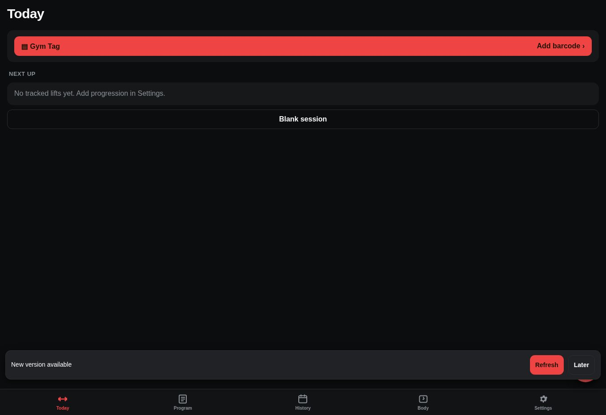 | 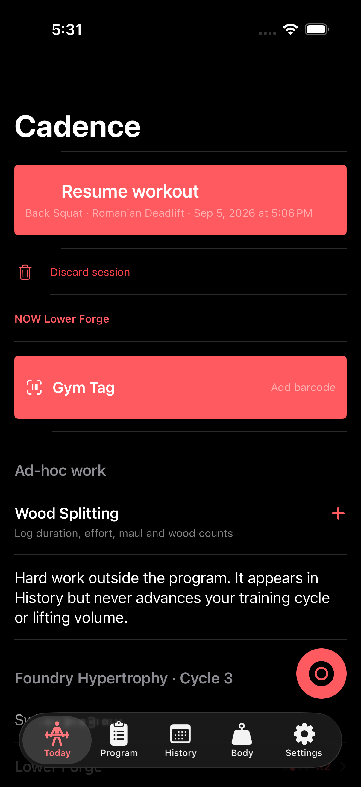 |
| Plate calculator | 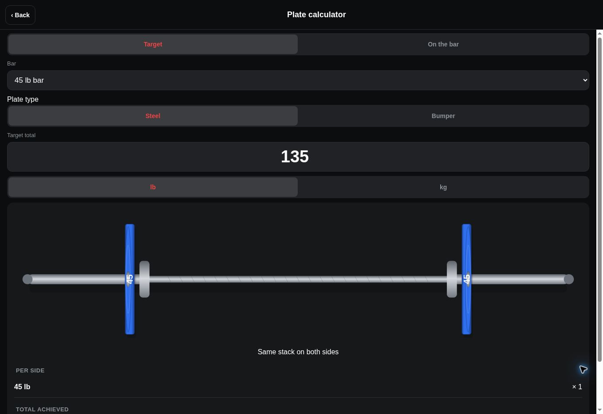 | 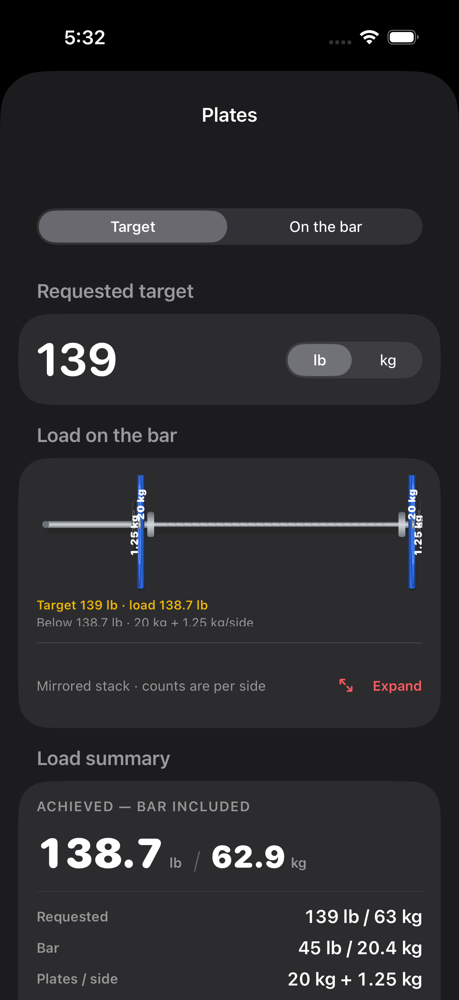 |
| Exercise and anatomy | 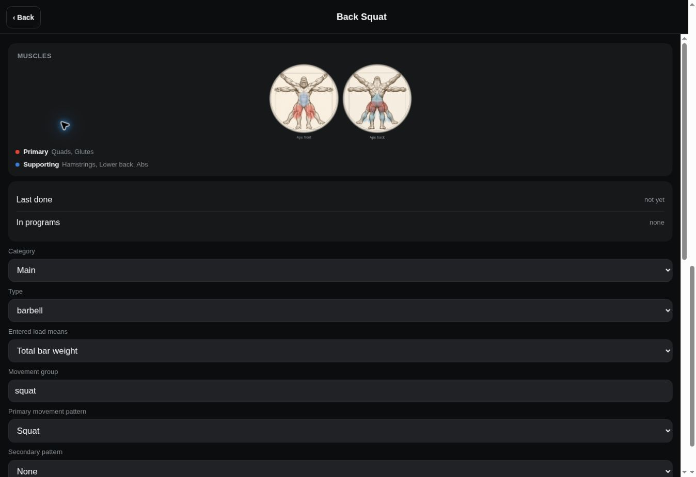 | 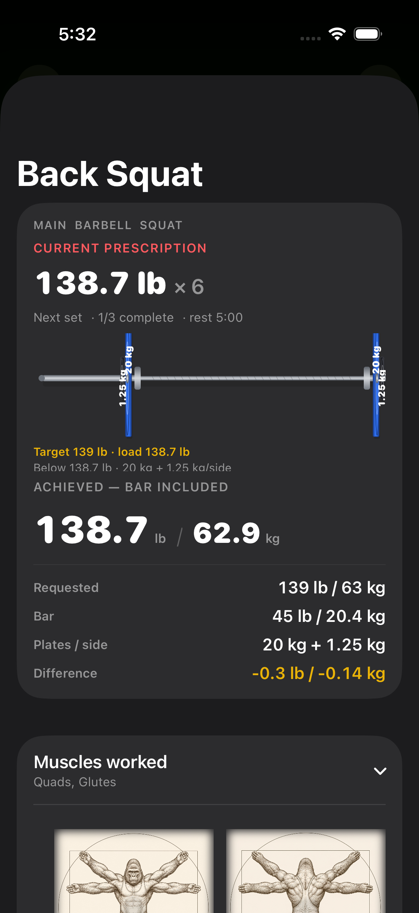 |
| Settings | 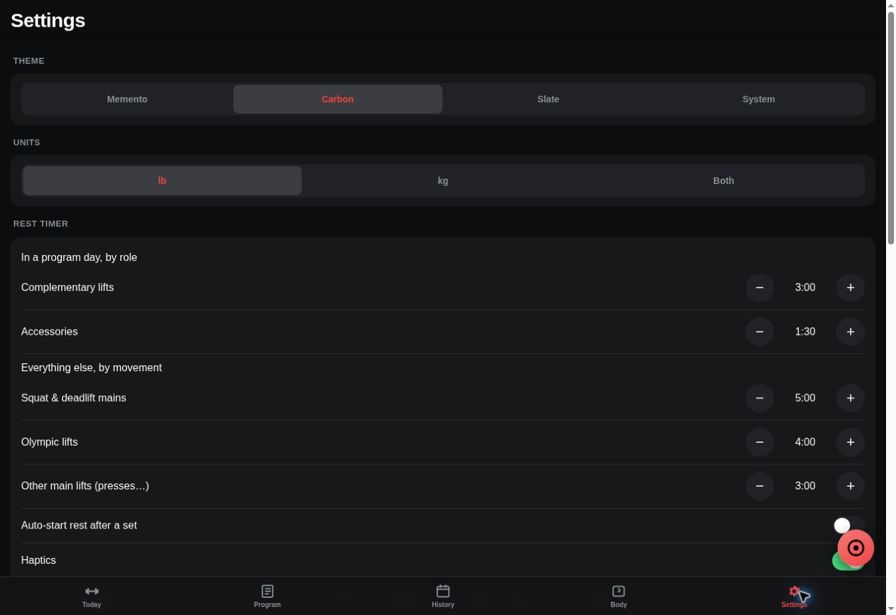 | 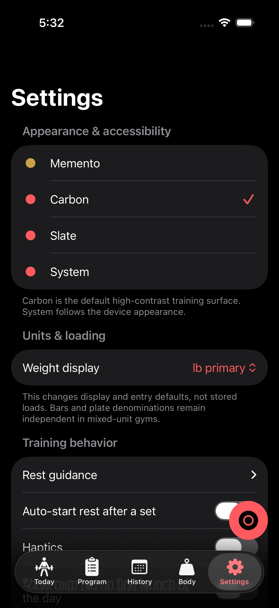 |

Wood Splitting had a typed #167 persistence shape but no dedicated interface in
the baseline. Its new entry and history surfaces are shown in the final capture
index below.

## Render-driven corrections

The first iPhone render was treated as an engineering input, not the result.
These pairs record the problems found in pixels and the corrected output.

| Finding | First render | Corrected render |
| --- | --- | --- |
| Completed rows displaced the current set below the fold | 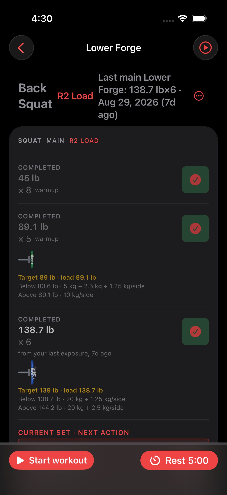 | 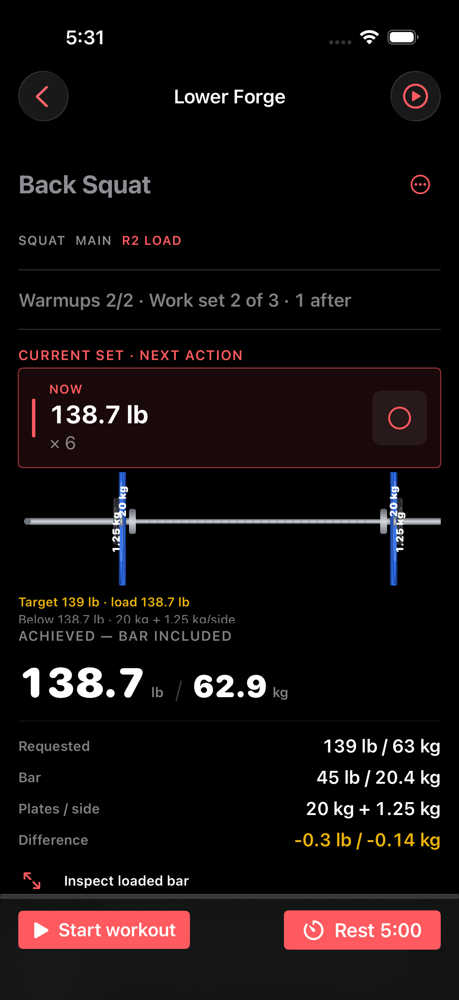 |
| Adjacent mixed-unit denominations collided | 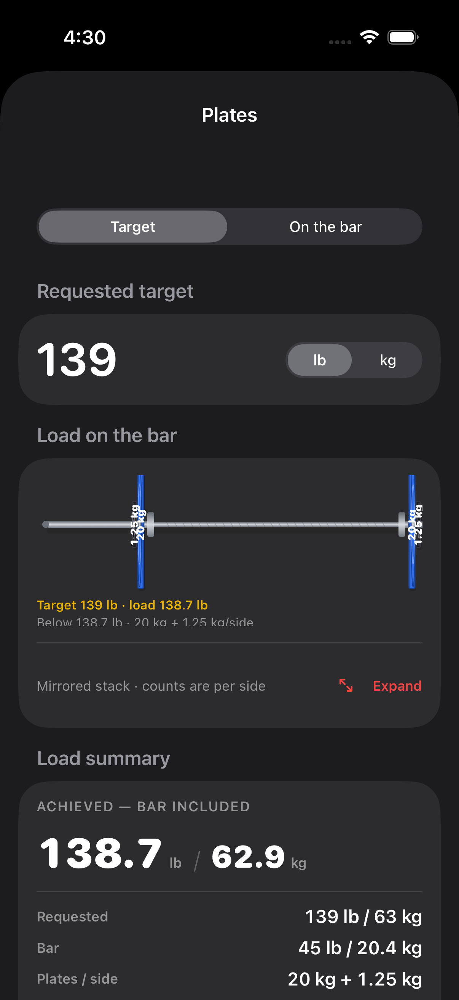 |  |
| Expanded bar was fixed-width and opened on only the left stack | 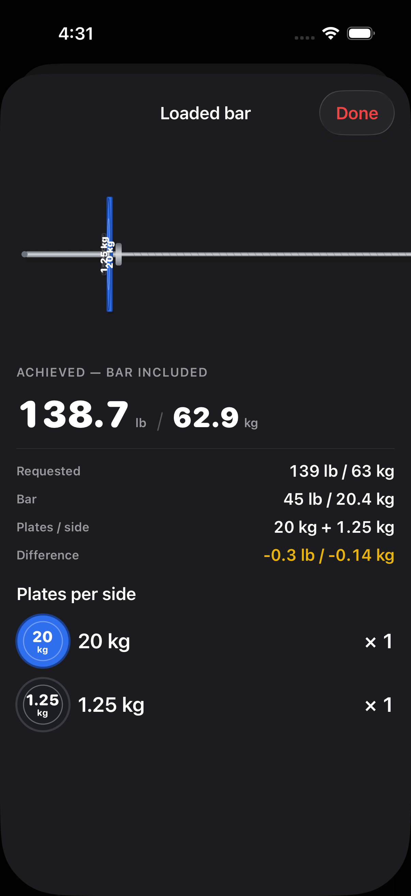 | 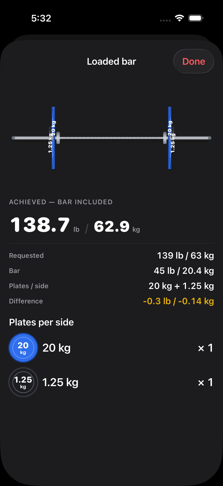 |

## Final iPhone capture index

1. [Today and Ad-hoc Work entry point](after/after-01-home-iphone.png)
2. [Wood Splitting quick log](after/after-02-ad-hoc-work-iphone.png)
3. [Current session and exact set loadout](after/after-03-current-session-iphone.png)
4. [Exercise information pane](after/after-04-exercise-pane-iphone.png)
5. [Preserved gorilla, no muscle selected](after/after-05-anatomy-unselected-iphone.png)
6. [Preserved gorilla, Quads selected](after/after-06-anatomy-selected-iphone.png)
7. [Plate calculator hero](after/after-07-plate-calculator-iphone.png)
8. [Expanded complete bar and stack](after/after-08-expanded-bar-iphone.png)
9. [Task-oriented Settings](after/after-09-settings-iphone.png)
10. [All-time History with separate ad-hoc work](after/after-10-history-ad-hoc-iphone.png)

## Native / web parity

| Contract | Native | Web |
| --- | --- | --- |
| Solver-selected loadout is rendered without view-side re-solving | `Loadout` passed to `BarbellView` | `loadout` passed to `barbellSVG` |
| Complete bar, collars, mirrored sides, metadata geometry | Yes | Yes |
| Exact denomination on every plate | Yes | Yes |
| Achieved total includes bar and leads lb, then kg | Yes | Yes |
| Target / reverse entered-stack modes | Yes | Yes |
| Current, completed, upcoming, and warmup emphasis | Yes | Yes |
| Exercise prescription / focus provenance | Yes | Yes |
| Exact gorilla raster plus interactive muscle regions | Yes | Yes |
| Six capability-backed Settings groups | Yes | Yes |
| Off-program activity creation, edit, delete, history, and backup | Yes | Yes |
| Visible focus, keyboard/touch targets, and reduced motion | VoiceOver / Dynamic Type / Reduce Motion | Keyboard / ARIA / `prefers-reduced-motion` |

## Evidence

- [Final visual workflow](https://github.com/madhakish/cadence/actions/runs/33980722038)
- [Screenshot artifact](https://github.com/madhakish/cadence/actions/runs/33980722038/artifacts/9973824422)
- [Full verification workflow](https://github.com/madhakish/cadence/actions/runs/33980722040)
- Visual tests: ten attachments, zero failures. Web verification: 3,267
  direct assertions plus 100 invariant-platform assertions (3,367 total).
- Protected-code audit: plate solving, plate metadata, programming engine,
  session completion, frozen schemas, and migration stages are unchanged.
  `ActivitySession` changes are additive edit/validation support for #167; the
  only other persistence-suite changes are focused regression tests.
