# iPhone design-pass proof

These are simulator captures, not mockups. The baseline checks out the exact
PR base (`11895fb95cde9e4b938831098d00dd0350b45bc2`); the final capture runs the
production views at candidate head
`f576b62bb67392c8a80948eeccd87a3091e0e89c`. Both use the same deterministic,
in-memory fixture and the same iPhone 17 Pro viewport (1206 × 2622 pixels).

The proof-only baseline patch adds an in-memory fixture/bootstrap and screenshot
target to the checked-out base. Its sole production-view source delta seeds the
calculator field to `139`; it does not change layout, styles, metadata, or the
renderer. That patch and its temporary CI job were removed after capture.

## Major surfaces

| Surface | Exact-base iPhone | Final iPhone | Material result |
| --- | --- | --- | --- |
| Today | 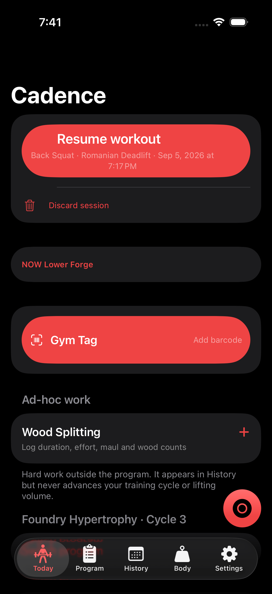 |  | Four equally loud utility containers no longer precede the workout. Training state and the resume/start action lead; utility actions remain direct. |
| Ad-hoc work | 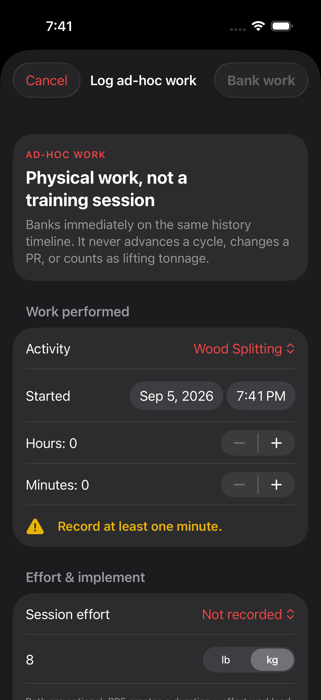 | 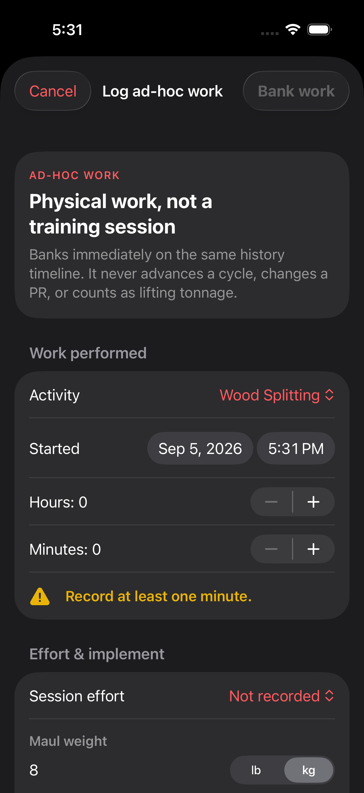 | The #167 Wood Splitting form is deliberately preserved as the off-program foundation, with duration, effort, optional facts, and explicit banking behavior. |
| Current session | 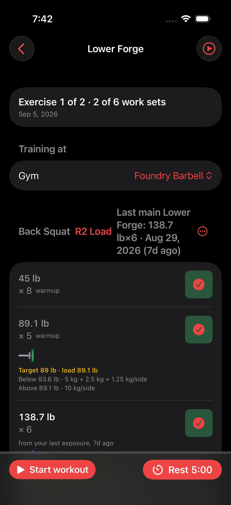 |  | The current exercise, set, achieved load, exact plates, and next action form one dominant boundary. Earlier completed work stays collapsed above it in authored order. |
| Exercise information | 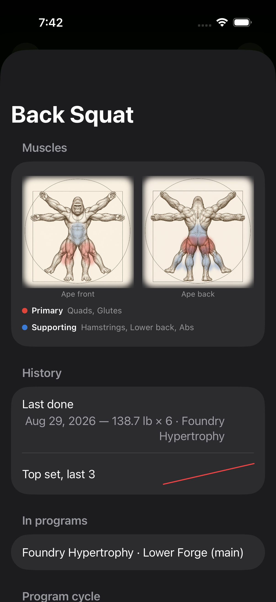 |  | Live prescription and truthful training-focus provenance lead; history, programming, and anatomy remain available through progressive disclosure. |
| Anatomy |  | 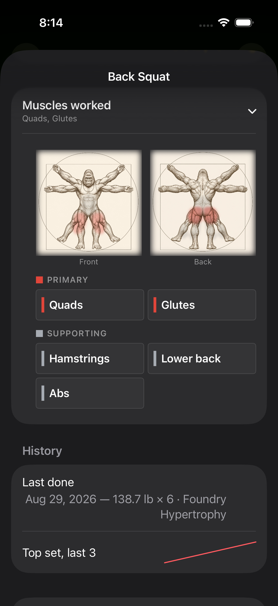 | The exact Vitruvian gorilla is retained and edge-feathered. Primary and supporting muscle regions are restrained, labelled controls instead of replacement artwork. |
| Plate calculator | 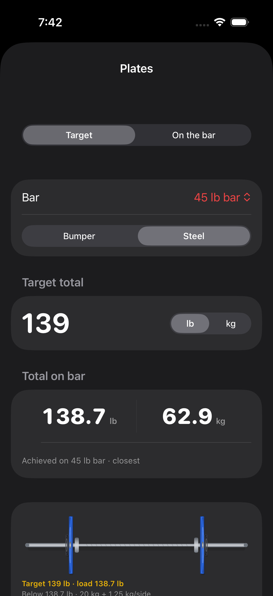 |  | The complete mirrored bar is the hero. Every plate keeps its exact denomination; achieved weight includes bar and collars and reads lb first, kg second. |
| Settings | 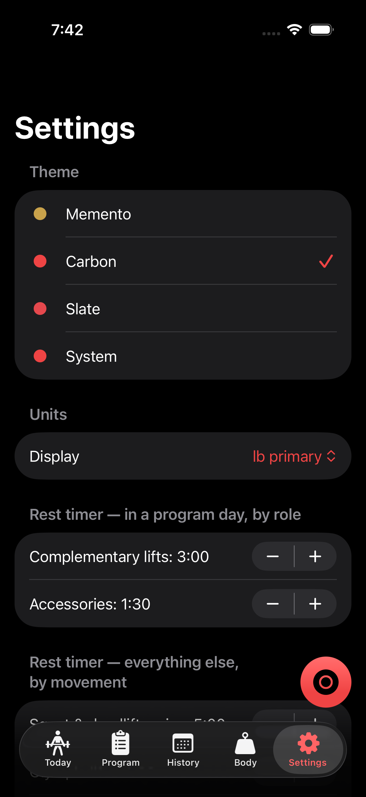 |  | Implementation-order rows become six task-oriented groups. Existing controls remain one tap away; no unsupported setting was invented. |
| History | 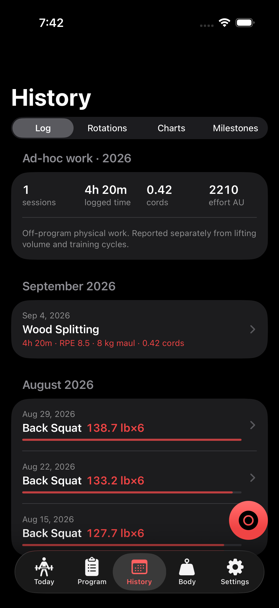 | 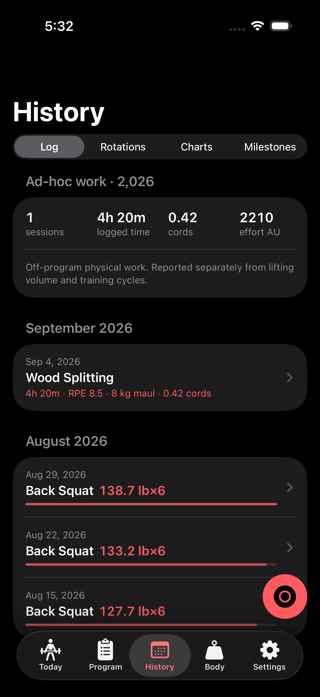 | All-time/program filtering remains intact. Ad-hoc work is visibly separate and never masquerades as lifting tonnage or cycle progress. |

The apparent similarity in the Ad-hoc Work and History pair is intentional:
#167 advanced while this pass was in progress, so the exact base already
contains the hardened activity UI. This branch consumes and preserves that
foundation instead of claiming it as a visual-pass invention.

## Render-driven corrections

The first render was treated as engineering input. These are real intermediate
simulator captures retained to show the pixel-level defects that were corrected.

| Finding | Observed render | Corrected render |
| --- | --- | --- |
| Completed rows displaced the current set below the fold |  |  |
| Adjacent mixed-unit denominations collided |  |  |
| Expanded bar opened at a fixed width on only the left stack |  |  |
| Decimal entry keyboard obscured the load summary | 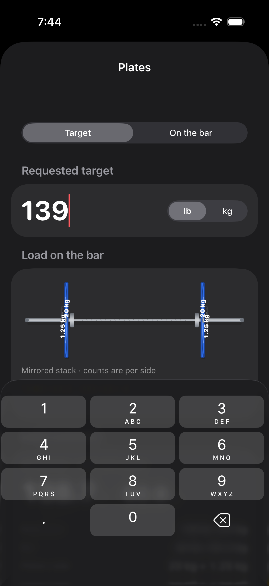 |  |

## Final iPhone capture index

1. [Today and Ad-hoc Work entry point](after/after-01-home-iphone.png)
2. [Wood Splitting quick log](after/after-02-ad-hoc-work-iphone.png)
3. [Current session and exact set loadout](after/after-03-current-session-iphone.png)
4. [Exercise information pane](after/after-04-exercise-pane-iphone.png)
5. [Preserved gorilla, no muscle selected](after/after-05-anatomy-unselected-iphone.png)
6. [Preserved gorilla, Quads selected](after/after-06-anatomy-selected-iphone.png)
7. [Plate calculator hero](after/after-07-plate-calculator-iphone.png)
8. [Expanded complete bar and stack](after/after-08-expanded-bar-iphone.png)
9. [Task-oriented Settings](after/after-09-settings-iphone.png)
10. [All-time History with separate ad-hoc work](after/after-10-history-ad-hoc-iphone.png)

## Native / web parity

| Contract | Native | Web |
| --- | --- | --- |
| Renderer consumes the selected solution without view-side solving | `PlateSolution` passed to `BarbellView` | `PlateSolution` passed to `barbellSVG` |
| Complete bar, collars, mirrored sides, metadata geometry | Yes | Yes |
| Exact denomination on every visible plate | Yes | Yes |
| Achieved total includes bar/collars and leads lb, then kg | Yes | Yes |
| Target mode and exact entered-stack reverse mode | Yes | Yes |
| Warmup, completed, current, and upcoming set states | Yes | Yes |
| Resolved prescription and complementary-focus provenance | Yes | Yes |
| Exact gorilla raster plus interactive muscle regions | Yes | Yes |
| Six capability-backed Settings groups with direct controls | Yes | Yes |
| Ad-hoc create, edit, confirmed delete, History, and backup | Yes | Yes |
| Focus, touch targets, reduced motion, and accessible labels | VoiceOver / Dynamic Type / Reduce Motion | Keyboard / ARIA / `prefers-reduced-motion` |

## Verification evidence

- [Exact-base and initial-current visual proof](https://github.com/madhakish/cadence/actions/runs/33987258925)
- [Exact-base screenshot artifact](https://github.com/madhakish/cadence/actions/runs/33987258925/artifacts/9975727723)
- [Initial-current screenshot artifact](https://github.com/madhakish/cadence/actions/runs/33987258925/artifacts/9975777749)
- [Corrected final visual proof](https://github.com/madhakish/cadence/actions/runs/33989092206)
- [Corrected final screenshot artifact](https://github.com/madhakish/cadence/actions/runs/33989092206/artifacts/9976209508)
- [Full native/web verification](https://github.com/madhakish/cadence/actions/runs/33989092207)
- Visual proof: four exact-base UI tests produced seven baseline screenshots;
  seven final UI tests produced ten screenshots. Both suites completed with
  zero failures. Web suite: 3,367 direct assertions plus 100 cross-platform
  invariant assertions (3,467 total), zero failures.
- Protected-code audit: plate solving, authoritative plate metadata,
  programming, session completion, frozen schemas, and migration semantics are
  unchanged. `ActivitySession` changes are additive edit/validation support for
  #167; the other persistence-suite changes are focused regression coverage.

This evidence documents #188's cohesive pass. The PR remains Part of #177 and
intentionally does not auto-close the epic or its sub-issues.
